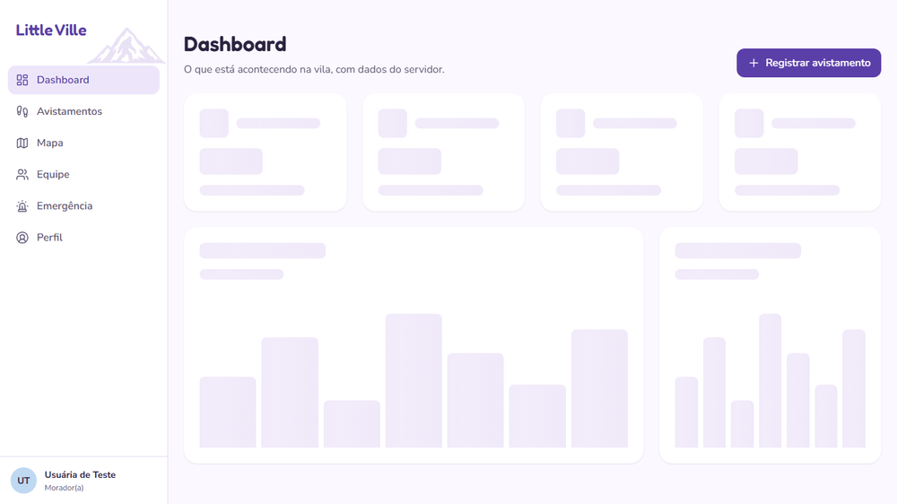
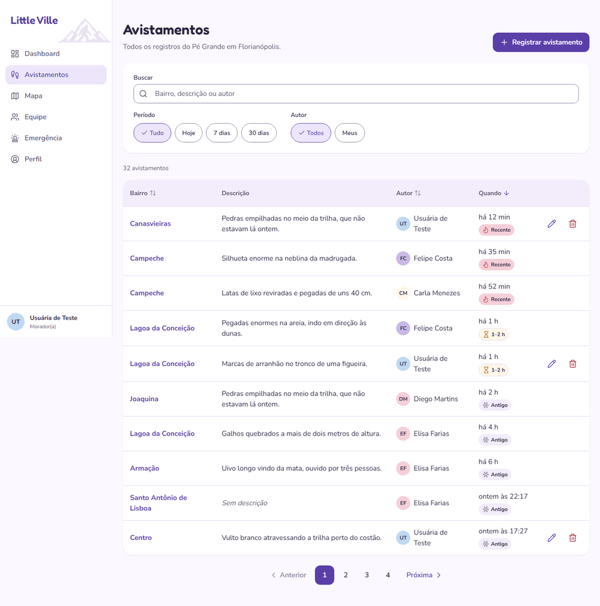
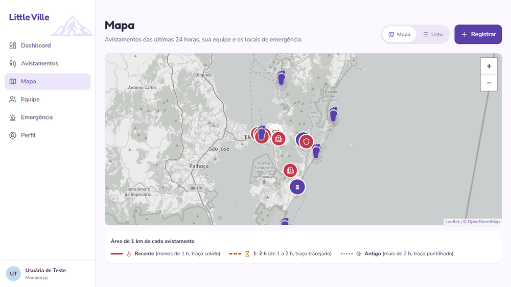
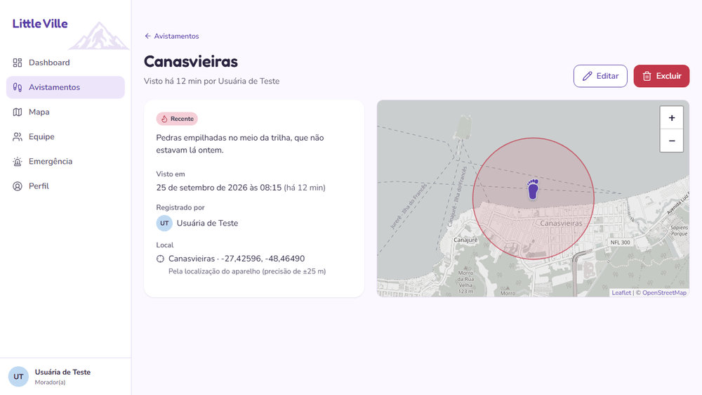
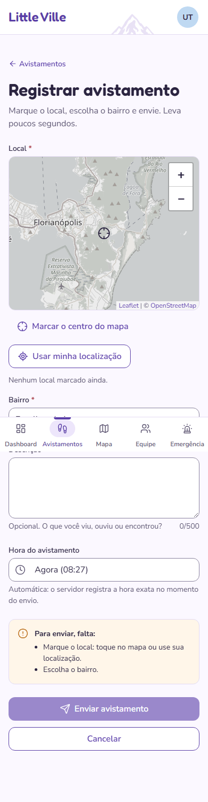

# Little Ville

Web app de **registro de avistamentos do Pé Grande** em Florianópolis. Moradores registram onde e
quando viram algo, acompanham no mapa as áreas de risco recentes, consultam um dashboard com
métricas e encontram os locais de emergência mais próximos.

Projeto Final de Desenvolvimento de Sistemas Integrados · SESI SENAI · 3º Ano A.

**Demonstração publicada:** _[preencher com o link da Vercel]_
Para entrar, use o login `usada@example.com` com a senha `Abcdefg1`.



---

## O que dá para fazer

| Tela | O que tem |
|---|---|
| **Intro e login** | Cena animada e cadastro em duas etapas, com validação de CPF e consentimento LGPD. |
| **Dashboard** | Total, últimos 7 dias, ativos agora e minha contribuição. Gráficos por dia, por período do dia e por bairro, cada um com tabela equivalente. Os 5 avistamentos mais recentes. |
| **Avistamentos** (CRUD completo) | Lista com busca, filtros, ordenação e paginação: tabela no computador, cartões no celular. Registrar, ver, editar e excluir, com **desfazer**. |
| **Registrar** | O local é obrigatório (toque no mapa, GPS ou teclado) e a hora é automática, do servidor. Sem local, o envio fica bloqueado e o motivo aparece. |
| **Mapa** | Áreas de 1 km que mudam com a idade do avistamento (Recente, 1–2 h, Antigo, com cor, ícone e traço). Equipe e locais de emergência no mapa. Visão em lista por distância. |
| **Emergência** | Hospitais, polícia, bombeiros, Defesa Civil e abrigos, com botão que liga direto. |

| | |
|---|---|
|  |  |
|  |  |

## Stack

- **React 19 + Vite 8**. **Tailwind CSS 4**, com escala e paleta próprias em `frontend/src/theme/tokens.css`.
- **React Router 7** (data router) e **TanStack Query 5** (cache, ações otimistas).
- **Recharts** para os gráficos e **react-leaflet** com leaflet.markercluster para o mapa.
- **zod** para os schemas do contrato, compartilhados em `shared/`, e **MSW** para o servidor simulado.
- **lucide-react** para os ícones e **@fontsource** para Fredoka e Nunito Sans, self-hosted.
- **Playwright** e **@axe-core/playwright** para os testes e2e e de acessibilidade.

Este repositório é só o **front-end**. A API segue o contrato em
[docs/API-CONTRACT.md](docs/API-CONTRACT.md).

## Como rodar

Precisa do **Node 22** ou mais novo.

```bash
cd shared && npm ci && cd ..
cd frontend && npm ci
npm run dev
```

Abra http://localhost:5173. Sem configurar nada, o app sobe em **modo mock**.

### Modo mock (servidor simulado)

Sem back-end no ar, o **MSW** simula a API no próprio navegador. São 32 avistamentos de
Florianópolis, 2 equipes e 10 locais de emergência, com as mesmas regras do contrato. Criar,
editar e excluir aparece na hora em todas as telas. Recarregar a página volta ao estado inicial.

| Na URL | O que faz |
|---|---|
| `?mock=logged-in` | Já entra logado (sem passar pelo login) |
| `?debug=1` | Painel de debug: latência, erros forçados, dados vazios, Admin, sessão expirada |
| `?frio=1` | Simula o servidor "acordando" (primeira resposta lenta) |
| `?desvio=120` | Adianta o relógio do servidor em 2 h (mostra o aviso de relógio desajustado) |

Exemplo: http://localhost:5173/avistamentos?mock=logged-in&debug=1

## Variáveis de ambiente

Copie `frontend/.env.example` para `frontend/.env` se quiser mudar o padrão. O `.env` nunca vai
para o git.

| Variável | Onde | Padrão | O que faz |
|---|---|---|---|
| `VITE_USE_MOCK` | build | `true` no `dev`, `false` no `build` | `true` usa o servidor simulado; `false` chama a API real |
| `VITE_API_URL` | build | `/api` | Base da API que o navegador chama |
| `API_URL` | só na Vercel | — | Base da API real, para onde a Vercel repassa `/api/*`. Obrigatória com `VITE_USE_MOCK=false` |
| `VITE_MAPA_TILES_URL` | build | OpenStreetMap | Fundo do mapa (ex.: CARTO Positron com a sua chave) |
| `VITE_MAPA_TILES_ATRIBUICAO` | build | © OpenStreetMap | Atribuição do fundo do mapa (exigida pela licença) |

## Comandos

Todos rodam dentro de `frontend/`.

| Comando | O que faz |
|---|---|
| `npm run dev` | Ambiente de desenvolvimento (modo mock) |
| `npm run check` | Lint, testes unitários e de contrato, varredura visual e build de produção |
| `npm run test:e2e` | Testes e2e e de acessibilidade (Playwright + axe) |
| `npm run build` | Build de produção. Falha se a entrada passar de 200 kB gzip ou se houver código do mock |
| `npm run build:vercel` | Build e pacote de deploy da Vercel (`.vercel/output`) |

## Publicar na Vercel

**1. Deixar o código na branch principal.** A Vercel publica a branch `main` como produção.
Junte as branches de trabalho na `main` por um pull request no GitHub. Outra opção: em
**Settings → Git → Production Branch**, escolher a branch que será publicada.

**2. Criar o projeto:**

1. Entre em https://vercel.com com a conta do GitHub.
2. Clique em **Add New… → Project** e escolha o repositório `SA_littleVille` (**Import**).
3. Em **Root Directory**, clique em **Edit** e escolha `frontend`.
4. Deixe marcada a opção **Include files outside the Root Directory in the Build Step**, que vem
   ligada por padrão. O app usa a pasta `shared/`, que fica fora de `frontend/`.
5. Em **Framework Preset**, escolha **Other**. Os comandos já estão no `frontend/vercel.json`,
   então não mexa em Build nem em Install.
6. Em **Environment Variables**, adicione `VITE_USE_MOCK` com o valor `true`.
7. Clique em **Deploy**.

**3. Conferir se subiu certo:**

- No log do build aparece `✔ Deploy montado em .vercel/output — MODO DEMONSTRAÇÃO (mock)`.
- Abrir a URL mostra a intro e o login.
- Entre com `usada@example.com` / `Abcdefg1`. Você passa pela tela de localização e cai no Dashboard.
- Recarregar a página em `/dashboard` não dá 404. Isso confirma o fallback da SPA.
- Abrir `/qualquer-coisa` mostra a página 404 com o mascote.

**Trocar para a API real depois**, sem mudar código:

1. Em **Settings → Environment Variables**, defina `VITE_USE_MOCK = false` e
   `API_URL = https://endereco-da-api/api`.
2. Em **Deployments**, abra o último deploy, clique em **⋯** e depois em **Redeploy**. Variáveis
   de ambiente só valem a partir de um build novo.
3. O navegador continua chamando `/api/...` no mesmo domínio, e a Vercel repassa para `API_URL`.
   Por isso o cookie de sessão funciona sem CORS.

> Por que `API_URL` não fica no `vercel.json`: esse arquivo não lê variáveis de ambiente. As
> rotas são geradas no build por `frontend/scripts/vercel-build.mjs`, pela Build Output API da
> Vercel. Ver [docs/DECISOES.md](docs/DECISOES.md), D20.

## Documentação

- [Requisitos](docs/REQUISITOS.md): RF, RNF e regras de negócio.
- [Contrato da API](docs/API-CONTRACT.md), versionado (hoje 1.1.0).
- [Decisões de arquitetura](docs/DECISOES.md), com o porquê de cada escolha.
- [Rastreabilidade](docs/RASTREABILIDADE.md): requisito → tela → arquivo → teste.

## Créditos

- Fundo do mapa: © [OpenStreetMap](https://www.openstreetmap.org/copyright) contributors.
  Mapa por [Leaflet](https://leafletjs.com).
- Ícones: [Lucide](https://lucide.dev). Fontes: Fredoka e Nunito Sans (SIL Open Font License).
- Os dados de avistamentos, pessoas e locais do modo demonstração são **simulados**. Os
  telefones são os números públicos de emergência (190, 192, 193, 199).
